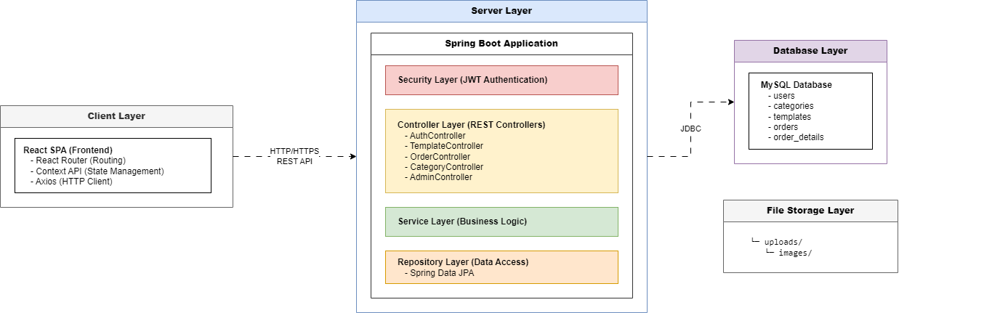
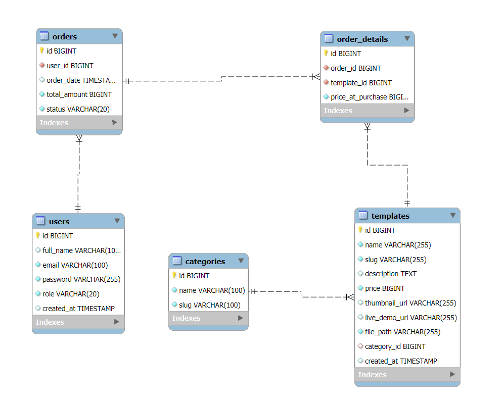

# 🛒 Template Shop - Hệ thống Bán Template Website

Một nền tảng thương mại điện tử chuyên về mua bán các template website chuyên nghiệp, được xây dựng với Spring Boot và React.

## 📸 Demo

### Screenshots

| Home Page | User | Admin Panel |
|-----------|---------|---------|
|  |  | |

## ✨ Features

### 🔐 Xác thực & Phân quyền
- Đăng ký/Đăng nhập người dùng với JWT Authentication
- Phân quyền: User và Admin
- Quản lý thông tin tài khoản cá nhân
- Protected routes cho các tính năng riêng tư

### 🎨 Chức năng dành cho Người dùng
- **Duyệt Template**: Xem danh sách template theo danh mục
- **Chi tiết Template**: Xem mô tả, hình ảnh, demo trực tiếp
- **Giỏ hàng**: Thêm/xóa/cập nhật số lượng sản phẩm
- **Thanh toán**: Đặt hàng và xác nhận thanh toán
- **Quản lý đơn hàng**: Xem lịch sử mua hàng, trạng thái đơn hàng
- **Responsive Design**: Giao diện thân thiện trên mọi thiết bị

### 👨‍💼 Chức năng dành cho Admin
- **Dashboard**: Thống kê doanh thu, đơn hàng, biểu đồ
- **Quản lý Template**: CRUD template (tạo, sửa, xóa)
- **Quản lý Danh mục**: Tổ chức template theo chủ đề
- **Quản lý Đơn hàng**: Xem, xử lý, cập nhật trạng thái
- **Quản lý Người dùng**: Xem danh sách, phân quyền
- **Upload File**: Quản lý hình ảnh và file template

## 🛠️ Tech Stack

### Backend
- **Framework**: Spring Boot 3.5.3
- **Language**: Java 21
- **Database**: MySQL 8.0
- **ORM**: Spring Data JPA / Hibernate
- **Security**: Spring Security + JWT (JSON Web Token)
- **File Upload**: Multipart File Handling
- **API Documentation**: RESTful API
- **Build Tool**: Maven

**Thư viện chính:**
- `spring-boot-starter-web` - REST API
- `spring-boot-starter-data-jpa` - Database access
- `spring-boot-starter-security` - Authentication & Authorization
- `jjwt` - JWT token generation/validation
- `mysql-connector-j` - MySQL driver
- `modelmapper` - DTO mapping

### Frontend
- **Framework**: React 19.1.0
- **Language**: JavaScript (ES6+)
- **Routing**: React Router DOM 7.6.2
- **Styling**: Tailwind CSS 4.1.10
- **HTTP Client**: Axios 1.10.0
- **Charts**: Chart.js + React Chart.js 2
- **Icons**: Heroicons + React Icons
- **UI Components**: Material-UI (MUI)
- **Animation**: Motion/Framer Motion
- **State Management**: Context API

## 🏗️ System Architecture

<div align="center">
  
</div>

### Luồng hoạt động:
1. **Client** gửi request đến **Server** qua REST API
2. **Security Layer** xác thực JWT token
3. **Controller** nhận request và gọi **Service**
4. **Service** xử lý business logic và gọi **Repository**
5. **Repository** tương tác với **MySQL Database**
6. Response được trả về theo chiều ngược lại

## 📁 Project Structure

```
source_code/
│
├── backend-templateshop/              # Spring Boot Backend
│   ├── src/
│   │   ├── main/
│   │   │   ├── java/com/nhanit/backend_templateshop/
│   │   │   │   ├── BackendTemplateshopApplication.java  # Main class
│   │   │   │   ├── config/                    # Cấu hình (CORS, Security, JWT)
│   │   │   │   ├── controller/                # REST Controllers
│   │   │   │   │   ├── AuthController.java
│   │   │   │   │   ├── TemplateController.java
│   │   │   │   │   ├── OrderController.java
│   │   │   │   │   ├── CategoryController.java
│   │   │   │   │   ├── AdminController.java
│   │   │   │   │   ├── AccountController.java
│   │   │   │   │   ├── DashboardController.java
│   │   │   │   │   └── FileController.java
│   │   │   │   ├── dto/                       # Data Transfer Objects
│   │   │   │   ├── entity/                    # JPA Entities
│   │   │   │   │   ├── User.java
│   │   │   │   │   ├── Template.java
│   │   │   │   │   ├── Category.java
│   │   │   │   │   ├── Order.java
│   │   │   │   │   └── OrderDetail.java
│   │   │   │   ├── exception/                 # Custom Exceptions
│   │   │   │   ├── repository/                # Spring Data JPA Repositories
│   │   │   │   ├── security/                  # JWT & Security Config
│   │   │   │   └── service/                   # Business Logic Services
│   │   │   └── resources/
│   │   │       ├── application.properties     # Cấu hình ứng dụng
│   │   │       ├── static/
│   │   │       └── templates/
│   │   └── test/                              # Unit Tests
│   ├── uploads/                               # File storage
│   │   └── images/
│   ├── pom.xml                                # Maven dependencies
│   └── mvnw, mvnw.cmd                         # Maven wrapper
│
├── frontend-templateshop/             # React Frontend
│   ├── public/
│   │   ├── index.html
│   │   ├── manifest.json
│   │   └── robots.txt
│   ├── src/
│   │   ├── App.js                             # Root component
│   │   ├── index.js                           # Entry point
│   │   ├── index.css                          # Global styles
│   │   ├── assets/                            # Images, fonts
│   │   ├── components/                        # React Components
│   │   │   ├── admin/                         # Admin components
│   │   │   │   ├── CategoryManager.js
│   │   │   │   ├── OrderManager.js
│   │   │   │   ├── TemplateManager.js
│   │   │   │   └── UserManager.js
│   │   │   ├── auth/                          # Authentication
│   │   │   │   ├── AdminRoute.js
│   │   │   │   └── ProtectedRoute.js
│   │   │   ├── cart/                          # Shopping cart
│   │   │   │   └── CartItem.js
│   │   │   ├── common/                        # Shared components
│   │   │   ├── layout/                        # Layout components
│   │   │   │   ├── AdminLayout.js
│   │   │   │   ├── Footer.js
│   │   │   │   ├── MainLayout.js
│   │   │   │   ├── Navbar.js
│   │   │   │   └── ScrollToTop.js
│   │   │   ├── products/
│   │   │   │   └── ProductCard.js
│   │   │   └── ui/                            # UI components
│   │   │       ├── ConfirmModal.js
│   │   │       ├── CustomPagination.js
│   │   │       ├── GradientButton.js
│   │   │       ├── NotificationModal.js
│   │   │       ├── OrdersChart.js
│   │   │       ├── RevenueChart.js
│   │   │       ├── ScrollToTopButton.js
│   │   │       └── SuccessToast.js
│   │   ├── contexts/                          # React Context
│   │   │   ├── AdminAuthContext.js
│   │   │   ├── AuthContext.js
│   │   │   ├── CartContext.js
│   │   │   └── NotificationContext.js
│   │   ├── pages/                             # Page components
│   │   │   ├── HomePage.js
│   │   │   ├── ProductsPage.js
│   │   │   ├── CartPage.js
│   │   │   ├── PaymentPage.js
│   │   │   ├── OrderSuccessPage.js
│   │   │   ├── LoginPage.js
│   │   │   ├── RegisterPage.js
│   │   │   ├── ProfilePage.js
│   │   │   ├── AboutPage.js
│   │   │   ├── ContactPage.js
│   │   │   ├── NewsPage.js
│   │   │   └── admin/
│   │   │       ├── AdminLoginPage.js
│   │   │       └── DashboardPage.js
│   │   └── services/                          # API Services
│   │       ├── api.js                         # Axios config
│   │       ├── authService.js
│   │       ├── categoryService.js
│   │       ├── dashboardService.js
│   │       ├── orderService.js
│   │       ├── templateService.js
│   │       └── userService.js
│   ├── package.json                           # NPM dependencies
│   ├── tailwind.config.js                     # Tailwind config
│   └── postcss.config.js                      # PostCSS config
│
└── Template_shop_db.sql                       # Database schema + sample data
```

## 🚀 Installation & Setup

### Yêu cầu hệ thống

- **Java**: JDK 21 hoặc cao hơn
- **Node.js**: v18.0.0 hoặc cao hơn
- **MySQL**: 8.0 hoặc cao hơn
- **Maven**: 3.8+ (hoặc sử dụng Maven Wrapper đi kèm)
- **NPM** hoặc **Yarn**

### 1️⃣ Cài đặt Database

```bash
# Đăng nhập MySQL
mysql -u root -p

# Import database
source Template_shop_db.sql

# Hoặc
mysql -u root -p < Template_shop_db.sql
```

**Lưu ý:** File SQL đã bao gồm:
- Tạo database `template_shop_db`
- Tạo các bảng (users, categories, templates, orders, order_details)
- Dữ liệu mẫu (4 danh mục, 10 users, 20 templates)

### 2️⃣ Cấu hình Backend

```bash
# Di chuyển vào thư mục backend
cd backend-templateshop

# Cấu hình database trong application.properties
# Chỉnh sửa file: src/main/resources/application.properties
```

**Cập nhật thông tin database:**
```properties
spring.datasource.url=jdbc:mysql://localhost:3306/template_shop_db
spring.datasource.username=root
spring.datasource.password=your_password

# JWT Secret (Có thể giữ nguyên hoặc thay đổi)
app.jwt-secret=404E635266556A586E3272357538782F413F4428472B4B6250645367566B5970
app.jwt-expiration-milliseconds=604800000

# Upload directory
file.upload-dir=./uploads
```

```bash
# Tạo thư mục upload
mkdir uploads
mkdir uploads/images

# Build project với Maven
./mvnw clean install
# Hoặc trên Windows:
mvnw.cmd clean install

# Chạy ứng dụng
./mvnw spring-boot:run
# Hoặc:
java -jar target/backend-templateshop-0.0.1-SNAPSHOT.jar
```

Backend sẽ chạy tại: **http://localhost:8080**

### 3️⃣ Cấu hình Frontend

```bash
# Di chuyển vào thư mục frontend
cd frontend-templateshop

# Cài đặt dependencies
npm install
# Hoặc
yarn install

# Kiểm tra cấu hình API endpoint
# File: src/services/api.js
```

**Đảm bảo API URL đúng:**
```javascript
const API_URL = 'http://localhost:8080/api/v1';
```

```bash
# Chạy development server
npm start
# Hoặc
yarn start
```

Frontend sẽ chạy tại: **http://localhost:3000**

### 4️⃣ Build cho Production

**Backend:**
```bash
cd backend-templateshop
./mvnw clean package -DskipTests
# File JAR: target/backend-templateshop-0.0.1-SNAPSHOT.jar
```

**Frontend:**
```bash
cd frontend-templateshop
npm run build
# Folder build: build/
```

## 🗄️ Database Schema

### ERD (Entity Relationship Diagram)

<div align="center">
  
</div>

### Bảng chi tiết

#### **users**
| Column | Type | Description |
|--------|------|-------------|
| id | BIGINT (PK) | ID người dùng |
| full_name | NVARCHAR(100) | Họ và tên |
| email | VARCHAR(100) (UK) | Email đăng nhập |
| password | VARCHAR(255) | Mật khẩu (BCrypt) |
| role | VARCHAR(20) | Vai trò: USER/ADMIN |
| created_at | TIMESTAMP | Ngày tạo tài khoản |

#### **categories**
| Column | Type | Description |
|--------|------|-------------|
| id | BIGINT (PK) | ID danh mục |
| name | NVARCHAR(100) | Tên danh mục |
| slug | VARCHAR(100) (UK) | Slug URL |

#### **templates**
| Column | Type | Description |
|--------|------|-------------|
| id | BIGINT (PK) | ID template |
| name | NVARCHAR(255) | Tên template |
| slug | VARCHAR(255) (UK) | Slug URL |
| description | TEXT | Mô tả chi tiết |
| price | BIGINT | Giá (VNĐ) |
| thumbnail_url | VARCHAR(255) | Ảnh thumbnail |
| live_demo_url | VARCHAR(255) | Link demo |
| file_path | VARCHAR(255) | Đường dẫn file |
| category_id | BIGINT (FK) | Danh mục |
| created_at | TIMESTAMP | Ngày tạo |
| updated_at | TIMESTAMP | Ngày cập nhật |

#### **orders**
| Column | Type | Description |
|--------|------|-------------|
| id | BIGINT (PK) | ID đơn hàng |
| user_id | BIGINT (FK) | Người mua |
| order_date | TIMESTAMP | Ngày đặt |
| total_amount | BIGINT | Tổng tiền |
| status | VARCHAR(20) | Trạng thái: PENDING/SUCCESS/CANCELLED |

#### **order_details**
| Column | Type | Description |
|--------|------|-------------|
| id | BIGINT (PK) | ID chi tiết |
| order_id | BIGINT (FK) | Đơn hàng |
| template_id | BIGINT (FK) | Template |
| quantity | INT | Số lượng |
| price_at_purchase | BIGINT | Giá tại thời điểm mua |

## 📡 API Endpoints

### Base URL
```
Backend: http://localhost:8080/api/v1
```

### 🔐 Authentication

| Method | Endpoint | Description | Auth |
|--------|----------|-------------|------|
| POST | `/auth/register` | Đăng ký tài khoản mới | Public |
| POST | `/auth/login` | Đăng nhập | Public |

### 👤 Account Management

| Method | Endpoint | Description | Auth |
|--------|----------|-------------|------|
| GET | `/account/profile` | Lấy thông tin tài khoản | User |
| PUT | `/account/profile` | Cập nhật thông tin | User |
| GET | `/account/orders` | Lấy lịch sử đơn hàng | User |

### 📦 Templates

| Method | Endpoint | Description | Auth |
|--------|----------|-------------|------|
| GET | `/templates` | Lấy danh sách template (phân trang) | Public |
| GET | `/templates/{slug}` | Lấy chi tiết template | Public |
| POST | `/admin/templates` | Tạo template mới | Admin |
| PUT | `/admin/templates/{id}` | Cập nhật template | Admin |
| DELETE | `/admin/templates/{id}` | Xóa template | Admin |

**Query Parameters (GET /templates):**
- `page`: Số trang (mặc định: 0)
- `size`: Số item/trang (mặc định: 10)
- `category`: Filter theo danh mục
- `search`: Tìm kiếm theo tên

### 🗂️ Categories

| Method | Endpoint | Description | Auth |
|--------|----------|-------------|------|
| GET | `/api/v1/categories` | Lấy tất cả danh mục | Public |
| POST | `/api/v1/admin/categories` | Tạo danh mục mới | Admin |
| PUT | `/api/v1/admin/categories/{id}` | Cập nhật danh mục | Admin |
| DELETE | `/api/v1/admin/categories/{id}` | Xóa danh mục | Admin |

### 🛒 Orders

| Method | Endpoint | Description | Auth |
|--------|----------|-------------|------|
| POST | `/orders` | Tạo đơn hàng mới | User |
| POST | `/orders/{id}/confirm-payment` | Xác nhận thanh toán | User |
| POST | `/orders/{id}/cancel` | Hủy đơn hàng | User |
| GET | `/admin/orders` | Lấy tất cả đơn hàng | Admin |
| GET | `/admin/orders/{id}` | Chi tiết đơn hàng | Admin |
| PUT | `/admin/orders/{id}/status` | Cập nhật trạng thái | Admin |

### 📊 Dashboard (Admin)

| Method | Endpoint | Description | Auth |
|--------|----------|-------------|------|
| GET | `/admin/dashboard/stats` | Thống kê tổng quan | Admin |
| GET | `/admin/dashboard/revenue-chart` | Dữ liệu biểu đồ doanh thu | Admin |

### 👥 Admin - User Management

| Method | Endpoint | Description | Auth |
|--------|----------|-------------|------|
| GET | `/admin/users` | Lấy danh sách người dùng | Admin |
| GET | `/admin/users/{id}` | Chi tiết người dùng | Admin |
| PUT | `/admin/users/{id}/role` | Thay đổi vai trò | Admin |

### 📁 Files

| Method | Endpoint | Description | Auth |
|--------|----------|-------------|------|
| GET | `/files/**` | Lấy file (ảnh, template) | Public |

### 🧪 Test Endpoints

| Method | Endpoint | Description | Auth |
|--------|----------|-------------|------|
| GET | `/test/public` | Public endpoint test | Public |
| GET | `/test/user` | User endpoint test | User |

---

## 🔒 Authentication Flow

1. User đăng ký/đăng nhập → Server trả về JWT token
2. Frontend lưu token vào localStorage
3. Mọi request sau đó đều gửi kèm header:
   ```
   Authorization: Bearer {token}
   ```
4. Backend verify token và cho phép/từ chối request

## 👨‍💻 Author

**Vo Trung Nhan (VTNMT2930)**

- GitHub: [@VTNMT2930](https://github.com/VTNMT2930)
- Email: nhantrung297@gmail.com

---

<div align="center">
  <p>Made with ❤️ by Nhân IT</p>
  <p>⭐ Star this repo if you find it helpful!</p>
</div>
